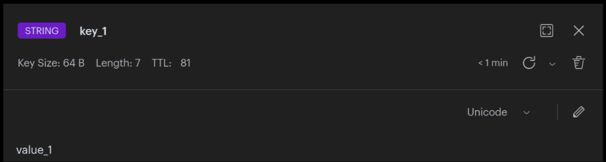

# Redis added to the docker compose file

Redis контейнер использует ту же сеть, имеет в ней адрес 10.10.0.3.

```shell
/data # ip a
1: lo: <LOOPBACK,UP,LOWER_UP> mtu 65536 qdisc noqueue state UNKNOWN qlen 1000
    link/loopback 00:00:00:00:00:00 brd 00:00:00:00:00:00
    inet 127.0.0.1/8 scope host lo
       valid_lft forever preferred_lft forever
    inet6 ::1/128 scope host
       valid_lft forever preferred_lft forever
2: eth0@if344: <BROADCAST,MULTICAST,UP,LOWER_UP,M-DOWN> mtu 1500 qdisc noqueue state UP
    link/ether d2:16:be:a3:a3:21 brd ff:ff:ff:ff:ff:ff
    inet 10.10.0.3/24 brd 10.10.0.255 scope global eth0
       valid_lft forever preferred_lft forever
```

Подключение проверено с помощью `redis-cli`:
```shell
/data # redis-cli
127.0.0.1:6379> auth $REDIS_PASSWORD
OK
127.0.0.1:6379> ping
PONG
```

# RedisInsight was also added for observability

Также, в ту же сеть был добавлен контейнер RedisInsight, который является
webui для Redis.

Так как контейнер не критичен для работы системы, выделен в отдельный профиль docker-compose:

```shell
docker compose --profile debug up -d # запуск с webui
docker compose up -d # запуск без webui
```

Проверено, что в web-ui видно ключи:
```shell
/data # redis-cli
127.0.0.1:6379> set key_1 value_1 ex 90 # key_1=value_1 с TTL 90 секунд
```


