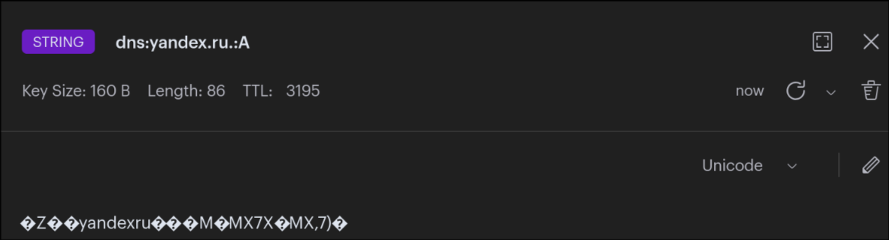

# Python proxy

Python-прокси сервер был поднят в той же Docker Compose сети `dns-lab`.

Проверена работа прокси днс-сервера:

## Первый запрос для TTL:
```shell
❯ dig @127.0.0.1 -p 5300 yandex.ru

; <<>> DiG 9.20.21 <<>> @127.0.0.1 -p 5300 yandex.ru
; (1 server found)
;; global options: +cmd
;; Got answer:
;; ->>HEADER<<- opcode: QUERY, status: NOERROR, id: 45146
;; flags: qr rd ra; QUERY: 1, ANSWER: 3, AUTHORITY: 0, ADDITIONAL: 1

;; OPT PSEUDOSECTION:
; EDNS: version: 0, flags:; udp: 1232
;; QUESTION SECTION:
;yandex.ru.                     IN      A

;; ANSWER SECTION:
yandex.ru.              3600    IN      A       5.255.255.77
yandex.ru.              3600    IN      A       77.88.55.88
yandex.ru.              3600    IN      A       77.88.44.55

;; Query time: 1681 msec
;; SERVER: 127.0.0.1#5300(127.0.0.1) (UDP)
;; WHEN: Thu Apr 02 10:36:45 MSK 2026
;; MSG SIZE  rcvd: 86
```

## Второй запрос

```shell
❯ dig @127.0.0.1 -p 5300 yandex.ru

; <<>> DiG 9.20.21 <<>> @127.0.0.1 -p 5300 yandex.ru
; (1 server found)
;; global options: +cmd
;; Got answer:
;; ->>HEADER<<- opcode: QUERY, status: NOERROR, id: 21448
;; flags: qr rd ra; QUERY: 1, ANSWER: 3, AUTHORITY: 0, ADDITIONAL: 1

;; OPT PSEUDOSECTION:
; EDNS: version: 0, flags:; udp: 1232
;; QUESTION SECTION:
;yandex.ru.                     IN      A

;; ANSWER SECTION:
yandex.ru.              3540    IN      A       77.88.44.55
yandex.ru.              3540    IN      A       5.255.255.77
yandex.ru.              3540    IN      A       77.88.55.88

;; Query time: 2 msec
;; SERVER: 127.0.0.1#5300(127.0.0.1) (UDP)
;; WHEN: Thu Apr 02 10:37:45 MSK 2026
;; MSG SIZE  rcvd: 86
```

## Изменение TTL вручную
После изменения TTL на RedisInsight-webui, видно, что изменения отражаются в dns TTL:

```shell
❯ dig @127.0.0.1 -p 5300 yandex.ru

; <<>> DiG 9.20.21 <<>> @127.0.0.1 -p 5300 yandex.ru
; (1 server found)
;; global options: +cmd
;; Got answer:
;; ->>HEADER<<- opcode: QUERY, status: NOERROR, id: 15243
;; flags: qr rd ra; QUERY: 1, ANSWER: 3, AUTHORITY: 0, ADDITIONAL: 1

;; OPT PSEUDOSECTION:
; EDNS: version: 0, flags:; udp: 1232
;; QUESTION SECTION:
;yandex.ru.                     IN      A

;; ANSWER SECTION:
yandex.ru.              116     IN      A       77.88.44.55
yandex.ru.              116     IN      A       5.255.255.77
yandex.ru.              116     IN      A       77.88.55.88

;; Query time: 1 msec
;; SERVER: 127.0.0.1#5300(127.0.0.1) (UDP)
;; WHEN: Thu Apr 02 10:51:02 MSK 2026
;; MSG SIZE  rcvd: 86
```

## Логи

Из output'а команды `dig`, видно, что второй запрос имеет TTL близкое к программно-заданному 3600.
Также, `Query time` занял на 2 порядка меньше времени, что свидетельствует об успешной работе днс прокси-сервера.

```shell
❯ docker logs dns-proxy -f
DNS proxy listening on port 53...
[MISS] dns:yandex.ru.:A
[HIT] dns:yandex.ru.:A
```

Первый запрос отсутствовал в Redis, поэтому разрешался с помощью upstream.
Второй запрос уже присутствовал в Redis, поэтому вернул ответ не обращаясь к внешним источникам.

Также, с помощью `redis-cli` было проверено, что запись действительно удаляется:
```shell
127.0.0.1:6379> TTL dns:yandex.ru.:A
(integer) 64
127.0.0.1:6379> TTL dns:yandex.ru.:A
(integer) -2
```

Между запусками команды запись в Redis успела истечь, и была удалена.

## Скришот из RedisInsight


